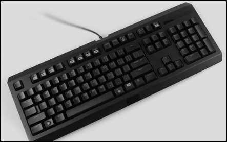
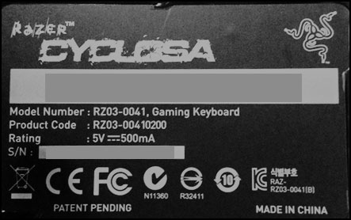

Fixes the _Razer Cyclosa_ keyboard media keys on Mac.

# Usage
1. Download and install [Karabiner](https://pqrs.org/osx/karabiner/) application.
2. Learn how to [add your own settings](https://pqrs.org/osx/karabiner/document.html.en#privatexml) to Karabiner.
3. The repository *private.xml* file contains the key remappings of   Razer Cyclosa media keys that you should add to your own *private.xml* file - or just replace it, if you have no further additions to make.

# Keyboard model

